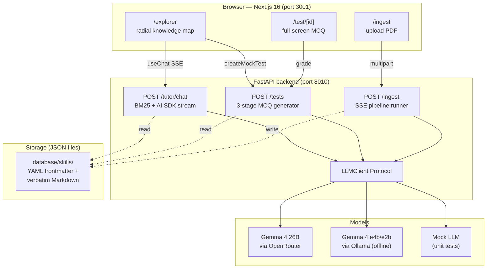
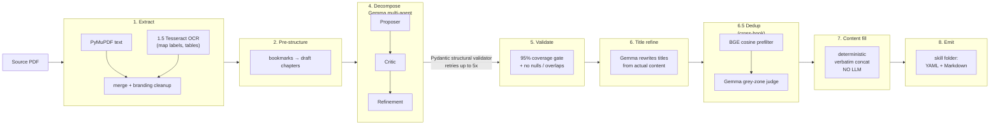
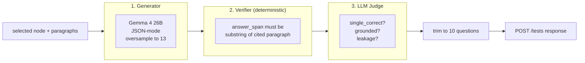
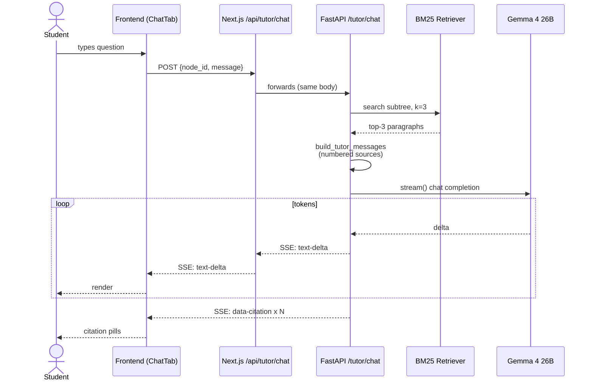

# Gemma Tutor — Architecture Diagram

> Visual reference for the Kaggle submission. Render the Mermaid blocks below in any tool that supports Mermaid (GitHub README preview, mermaid.live, Obsidian, Notion, etc.) to export PNG/SVG for the writeup.

## High-level system

## V2 ingestion pipeline (8 stages)

## Mock test generator (3 stages)

## Tutor chat data flow

## Why these specific choices

| Decision | Reason | Spec |
|---|---|---|
| Source preservation (no LLM paraphrasing) | Trustworthy citations + ground truth for MCQ verification | A.1 |
| Pydantic structural validator | Catches null leaves & overlapping ranges at parse time, retries with feedback to Gemma | A.9 |
| Tesseract OCR (Stage 1.5) | 100% of audit pages had image-rendered content invisible to PyMuPDF | A.10 |
| Title refiner (Stage 6) | Gemma drifts one section header late; refining from content fixes it without touching ranges | A.11 |
| BM25 over subtree (not full book) | Bounded retrieval; chat is scoped to selected node anyway | tutor-chat |
| AI SDK UI Message Stream protocol direct from FastAPI | Skip the buggy `@openrouter/ai-sdk-provider` (per research note) | streaming-chat |
| 3-stage MCQ pipeline | MMLU-Pro recipe; deterministic verifier replaces expert review (free) | mcq-generation |
| BGE-small + Gemma judge dedup | Local embeddings cheap; LLM only for grey-zone pairs | dedup |

Spec details: see `docs/superpowers/specs/2026-04-17-v2-ingestion-pipeline-design.md` and the per-feature specs from 2026-05-02 onward.
